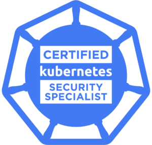

	

# CNCF - Certified Kubernetes Security Specialist (CKS)

## About

The Certified Kubernetes Security Specialist (CKS) program provides assurance that a CKS has the skills, knowledge, and competence on a broad range of best practices for securing container-based applications and Kubernetes platforms during build, deployment and runtime.

## Domains
| Domain | Weight |
| -------|------- |
Cluster Setup | 10%
Cluster Hardening | 15%
System Hardening | 15% 
[Minimize Microservice Vulnerabilities](minimize_microservice_vulnerabilities) | 20%
Supply Chain Security | 20%
Monitoring, Logging, and Runtime Security |  20%
