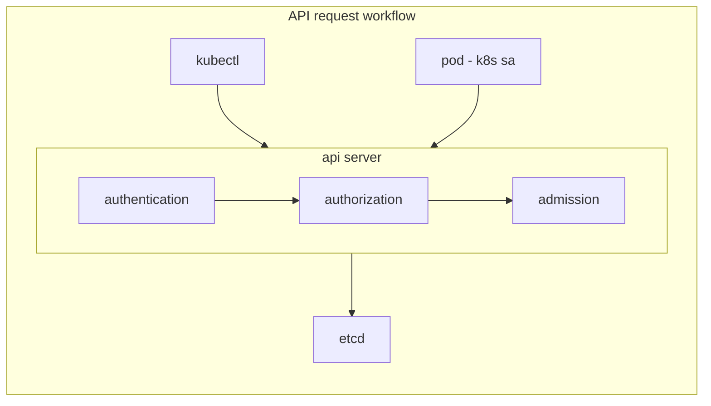

# Restrict access to K8s API

## K8s API Request workflow

Every API request (e.g: Create a new pod) must pass through 3 level of security:
- Authentication - Who are you?
- Authorization  - Are you allowed to create pod? (verb: create, resource: pod)
- Admission - Are there any additional restriction on Pod creation? For e.g: restrict Pod if image is from insecure registry



API requests are always tied to:
1. A normal user
2. A ServiceAccount
3. Are treated as anonymous requests

## Restrictions

**NOTE:** 1-4 covered by CKS

1. Do not allow [anonymous access](https://kubernetes.io/docs/reference/access-authn-authz/authentication/#anonymous-requests)
2. Close insecure port
```
kube-apiserver --insecure-port=8080 # Bypass auth and authz modules, admission controller still enforces
```
4. Do not expose API server to outside
5. Restrict access from Nodes to API (NodeRestriction admission plugin)
```
kube-apiserver --enable-admission-plugins=NodeRestriction
# Also, limits the Node labels a kubelet can modify
# Thus ensures seure workload isolation via labels

export KUBECONFIG=/etc/klubernetes/kubelet.conf
kubect get nodes # allowed
kubectl get pods # not allowed

kubectl label node cks-master cks/test=yes # not allowed, forbidden
kubectl label node cks-worker cks/test=yes # allowed, own node
kubectl label node cks-worker node-restriction.kubernetes.io/test=yes # not allowed  to modify restricted labels

```
6. Prevent unauthorized access (RBAC)
7. Prevent pods from accessing API
8. Protect API server behind firewall or allowed IP ranges (cloud provider)

## Different ways to connect to K8s API

### Anonymous access

### Kubectl

### Insecure Access

**Task:**
- Enable insecure API access and send API request

### Send manual API request

**Task:**
- Using `kubeconfig` certs, perform a manual API query
- Head to master node: `kubectl config view --raw`
- Extract CA data into ca.pem
- Extract client cert data into client.crt
- Extract client key data into client.key
- Extract server address

```
curl $API_SERVER --cacert ca.pem --cert client.crt --key client.key
```


### Send API request from outside

```
kubectl edit svc kubernetes -n default
```

```diff
spec:
-  type: ClusterIP
+  type: NodePort
```

```
kubectl get svc kubernetes
```


## Resources
- https://kubernetes.io/docs/concepts/security/controlling-access/
