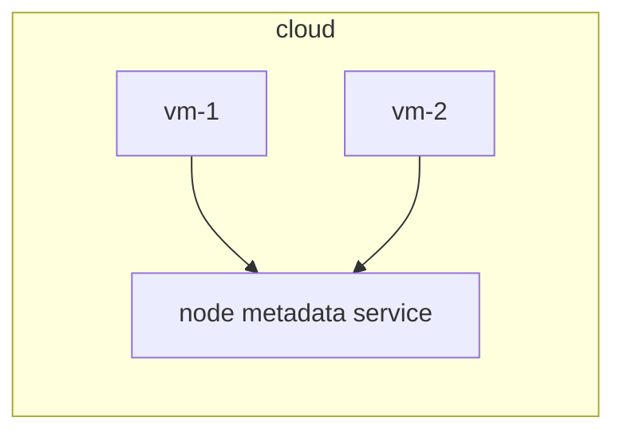

# Protect node metadata and endpoints

## What is node metadata and endpoints?

- Node metadata is a data exposed by node metadata service endpoint.
- Node metadata endpoint is made accessible for VMs to query about node metadata in a cloud environment (e.g: GCP, AWS)

>[!WARNING]
> - Node metadata API service is by default made reachable by VMs
> - The node metadata can container cloud credentials for VMs
> - In Kubernetes cluster VMs, node metadata can contain provisioning data like kubelet credentials.

## Access senstiive node metadata

## Restrict access using NetworkPolicy
