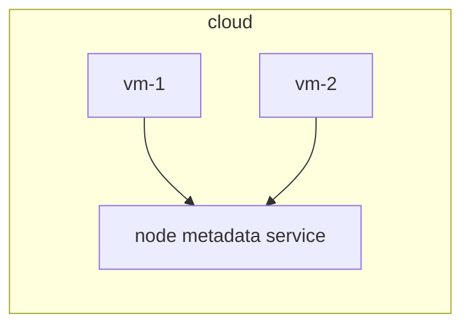

# Protect node metadata and endpoints

## What is node metadata and endpoints?

- Node metadata is a data exposed by node metadata service endpoint.
- Node metadata endpoint is made accessible for VMs to query about node metadata in a cloud environment (e.g: GCP, AWS)



>[!WARNING]
> - Node metadata API service is by default made reachable by VMs (i.e, Pods running in the VMs)
> - The node metadata can container cloud credentials for VMs
> - In Kubernetes cluster VMs, node metadata can contain provisioning data like kubelet credentials.

## Restrict access using NetworkPolicy

```yaml
apiVersion: networking.k8s.io/v1
kind: NetworkPolicy
metadata:
  name: deny-metadata-access
  namespace: default
spec:
  podSelector: {} # match all pods
  policyTypes:
  - Egress
  egress:
  - to:
    - ipBlock:
        cidr: 0.0.0.0/0        # Allow all
        except:
        - 169.254.169.254/32   # Node metadata service endpoint
```

```yaml
apiVersion: networking.k8s.io/v1
kind: NetworkPolicy
metadata:
  name: allow-metadata-access
  namespace: default
spec:
  podSelector:
    matchLabels:
      role: allow-metadata-access      # Allow pods with this label
  policyTypes:
  - Egress
  egress:
  - to:
    - ipBlock:
        cidr: 169.254.169.254/32   # Node metadata service endpoint
```
